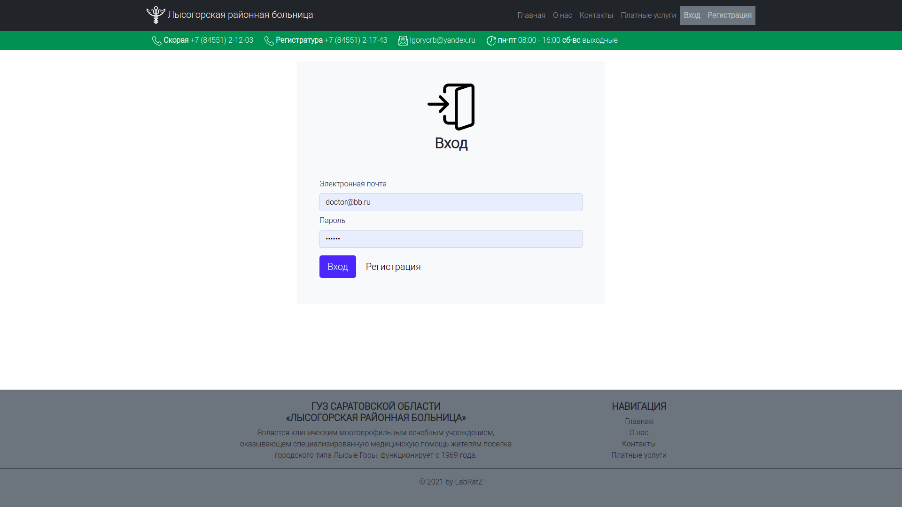

# hosp

Another project for a particular student. He had to write a website for a clinic/hospital, so I shortly named project as `hosp`.
I also offered him to make a web-application on technologies that I knew and wanted to do some more things with them.

`master` branch is no more maintained. `hosp-simplefile` is a branch where I rejected idea to implement file entity and service for managing it.

I don't think that I will continue to work on this project. It has some security and design issues that can be fixed, but project doesn't have an end goal, so it senseless to work on it.

- - -

### Some screenshots




### IDE
IDE used:
* JetBrains PHPStorm 2020.2
* Visual Studio Code 1.56.1

### Icons
Icons used in this project are all free and opensource.
[You can search them here](https://www.flaticon.com)

### Package manager
Project uses Composer 1.10.1
All versions and dependencies listed in composer.json

### Languages
Programming languages involved:
1. PHP 7.2.34
1. JavaScript

### Technologies
Technologies involved:
1. PHP Symfony Framework v3.4
1. Doctrine ORM v2.7.5
1. Twig Templating Engine v2.14.6
1. Bootstrap 4 and 5
1. MySQL v8.0.25
1. jQuery 
1. AJAX

### Development environment startup instructions
Instructions for starting project:
1. Clone this repository
1. Install PHP and Composer following these instructions:  
    1. Open terminal and execute these commands:
        ```
        sudo add-apt-repository ppa:ondrej/php
        sudo apt-get update
        sudo apt-get install composer php7.2 php7.2-xdebug php7.2-xml php7.2-mysql php7.2-mbstring php7.2-gd php7.2-intl php7.2-curl
        ```
    1. Make sure all installed correctly using this commands:
        ```
        php -v
        composer
        ```
    1. Downgrade composer:
        ```
        composer self-update 1.10.1
        ```
1. Install MySQL:
    1. Use terminal:
        ```
        sudo apt install mysql-server
        ```
    1. Create `mysql` user with these commands:
        ```
        mysql -u root
        CREATE USER 'mysql'@'localhost' IDENTIFIED WITH mysql_native_password BY 'mysql';
        GRANT ALL PRIVILEGES ON *.* TO 'mysql'@'localhost';
        FLUSH PRIVILEGES;
        ```
1. Open terminal at the root of a project (where composer.json is located) and run:
    ```
    composer install
    ```
1. Run `deploy.sh` to deploy a mysql database. To do that execute:
    ```
    sh  deploy.sh
    ```
1. Finally, run development web-server to startup the project:
    ```
    bin/console server:start
    ```

- - -

### Documentation
To get some more info about commands, features and other visit [Symfony 3.4 Documentation](https://symfony.com/doc/3.4/index.html)

- - -

If you have some questions feel free to ask. Although my English is not so good, so I might have missed some things.
